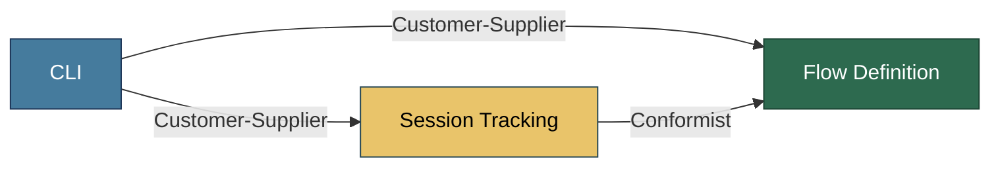

# Context Map: flowr

> DDD context map showing relationships between bounded contexts.
> Updated by the Software Architect when contexts or relationships change.
> Follows the DDD strategic design patterns for inter-context relationships.

---

## Context Relationships

| Upstream Context | Downstream Context | Relationship Pattern | Translation / Anti-Corruption Layer |
|-----------------|-------------------|---------------------|-------------------------------------|
| Flow Definition | CLI | Customer-Supplier | CLI consumes Flow Definition's public API (load, validate, convert, check, next). No translation needed — CLI uses Flow domain types directly. |
| Session Tracking | CLI | Customer-Supplier | CLI reads and writes session state through SessionStore. No translation needed — CLI uses Session domain types directly. |
| Flow Definition | Session Tracking | Conformist | Session Tracking references Flow names and state IDs from Flow Definition's schema. Session Tracking conforms to Flow Definition's model without translation — it stores flow name strings and state ID strings that must match Flow's vocabulary. |

---

## Context Map Diagram

---

## Integration Points

| Integration | From | To | Mechanism | Contract |
|-------------|------|----|-----------|----------|
| Flow Loading | CLI | Flow Definition | Sync API — CLI calls `load_flow(path)` to parse YAML into domain objects | `Flow` dataclass: states, transitions, conditions, params, exits, attrs |
| Flow Validation | CLI | Flow Definition | Sync API — CLI calls `validate(flow)` and receives `ValidationResult` | `ValidationResult`: list of `Violation` objects with severity, message, location |
| Flow Conversion | CLI | Flow Definition | Sync API — CLI calls `convert(flow, format)` to produce output | Mermaid stateDiagram-v2 text output |
| Transition Checking | CLI | Flow Definition | Sync API — CLI calls `check_transition(flow, state, trigger, evidence)` | `AvailableTransitions`: list of valid next states with conditions |
| Flow Name Resolution | CLI | CLI (internal) | Sync API — `FlowNameResolution.resolve(name, flows_dir)` maps short names to file paths | `ResolvedFlowPath`: file path or error |
| Session Init | CLI | Session Tracking | Sync API — CLI calls `SessionStore.init(flow_name)` to create a new session | `Session` YAML file in `.flowr/sessions/` |
| Session State Read/Write | CLI | Session Tracking | Sync API — CLI calls `SessionStore.load(session_name)` and `SessionStore.save(session)` | `Session` dataclass: flow_name, current_state, stack, params |
| Session Transition | CLI | Session Tracking | Sync API — CLI calls `TransitionSession` command which validates via Flow Definition then updates session | `Session` with updated state and stack |
| Flow Reference | Session Tracking | Flow Definition | Shared vocabulary — Session stores `flow_name` (string) and `state` (string) that reference Flow Definition's schema | Flow name must match a YAML file in flows directory; state must match a state ID in that flow |

---

## Anti-Corruption Layers

| ACL | Protects Context | From Context | Translation Rules |
|-----|-----------------|--------------|-------------------|
| *(none)* | — | — | No anti-corruption layers are needed. All three contexts are internal to the same application and share the same ubiquitous language. Session Tracking conforms to Flow Definition's schema directly, and CLI is a driving adapter that orchestrates both. |

---

## Changes

| Date | Source | Change | Reason |
|------|--------|--------|--------|
| 2026-05-01 | Domain Modeling | Initial context map created with three bounded contexts: Flow Definition, CLI, Session Tracking | Formalization of bounded context relationships from event storming and domain modeling |