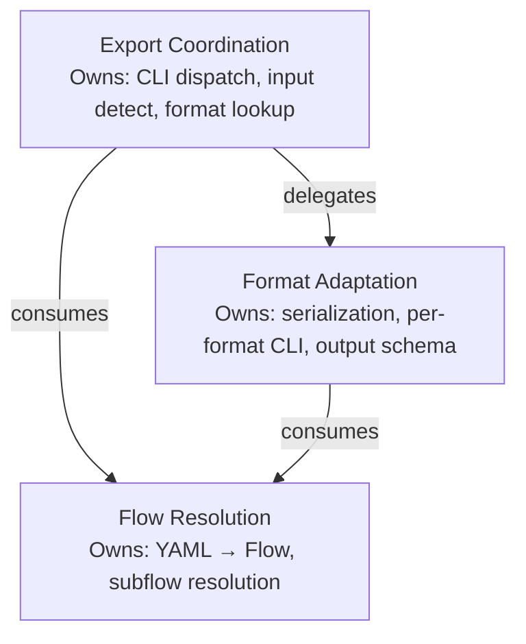

# Domain Model: flowr

Formalized from `event_storming.md` and `glossary.md`. Defines bounded contexts, entities, relationships, and aggregate boundaries for the export feature.

---

## Summary

The export feature introduces two new bounded contexts — Export Coordination and Format Adaptation — that sit above the existing Flow Resolution context. Export Coordination owns the CLI dispatch, input classification, and format registry lookup. Format Adaptation owns per-format serialization logic, with each adapter implementing a shared Protocol. Three aggregates govern consistency: ExportSession (one per invocation), ExportRegistry (singleton, immutable), and FlowExporter (one per concrete adapter, stateless). The feature replaces `flowr mermaid` with `flowr export --format mermaid` and adds `flowr export --format json`, using a hardcoded dict registry with no entry-point extensibility. All existing domain types (Flow, State, Transition, GuardCondition) are consumed as-is with no modifications.

---

## Bounded Contexts

Three bounded contexts govern the export feature. Context boundaries are drawn where responsibilities, invariants, and ubiquitous language diverge.

### BC1: Export Coordination

Orchestrates a single `flowr export` invocation end-to-end. Owns the CLI `export` subcommand, its argument parser, and the dispatch logic that wires format resolution → input classification → adapter invocation. This context does not understand any output format — it delegates format-specific work to the Format Adaptation context via the FlowExporter Protocol.

**Ubiquitous language:** format name, input path, adapter options, export session, registry.

**Owning module:** `flowr.cli` (export subcommand handler).

**Events produced:** ExportRequested, FormatResolved, AdapterArgumentsParsed, InputClassified.

**Commands handled:** RequestExport, ResolveFormat, ParseAdapterArguments, ClassifyInput.

### BC2: Format Adaptation

Transforms loaded Flow domain objects into specific output representations. Each adapter implements the FlowExporter Protocol and owns its serialization logic, CLI argument definitions, and output schema. Adapters are autonomous: no adapter knows about other adapters or about the export coordination logic.

**Ubiquitous language:** nodes, edges, conditions, flat mode, stateDiagram-v2, diagram separator, default flow.

**Owning module:** `flowr.exporters` package (new: `__init__.py`, `json_exporter.py`, `mermaid_exporter.py`). The Protocol lives in `flowr.domain.export.py`.

**Events produced:** FlowExported, DirectoryExported.

**Commands handled:** ExportFlow, ExportDirectory.

### BC3: Flow Resolution (existing, unchanged)

Loads YAML files into Flow domain objects and resolves subflow cross-references. The export feature **consumes** this context but does not own or modify it. Depends on the Flow, State, Transition, and GuardCondition domain types from `flowr.domain.flow_definition`.

**Ubiquitous language:** flow, state, transition, trigger, guard condition, subflow, exit.

**Owning module:** `flowr.domain.loader`, `flowr.domain.flow_definition` (existing, unchanged).

**Events produced:** FlowLoaded, SubflowsResolved.

**Commands handled:** LoadFlow, ResolveSubflows.

### Context Map

**Relationships:**

- Export Coordination → Format Adaptation: **delegation** (coordination invokes adapter methods via FlowExporter Protocol).
- Export Coordination → Flow Resolution: **conformist** (consumes Flow, State, Transition types as-is).
- Format Adaptation → Flow Resolution: **conformist** (receives loaded Flow objects; does not load files itself).

---

## Entities

### BC1: Export Coordination

#### ExportSession

An ephemeral aggregate representing a single `flowr export` invocation from start to finish. Holds the resolved format name, classified input path, loaded flows, and adapter-specific options. Not persisted — exists only for the duration of the CLI call.

| Attribute | Type | Description |
|-----------|------|-------------|
| `format_name` | `str` | Requested format (e.g., `"json"`, `"mermaid"`) |
| `input_path` | `Path` | File or directory argument from CLI |
| `is_directory` | `bool` | True when input_path is a directory |
| `flows` | `list[Flow]` | Loaded Flow domain objects |
| `adapter_options` | `dict[str, Any]` | Per-adapter parsed CLI flags |

**Lifecycle:** Created at CLI entry → populated through resolve → classify → load → export → destroyed at process exit.

**Invariants:**

- `format_name` must be a key in the ExportRegistry before export proceeds.
- `input_path` must exist on disk.
- At least one Flow must be loaded for export to proceed (empty directory produces a valid but empty collection for adapters that support directory export).

#### ExportRegistry

A singleton that maps format name strings to FlowExporter instances. Hardcoded at module load time — no runtime registration, no entry points.

| Attribute | Type | Description |
|-----------|------|-------------|
| `entries` | `dict[str, FlowExporter]` | Format name → adapter instance |

**Lifecycle:** Initialized once at module import. Never mutated.

**Invariants:**

- Every value implements the FlowExporter Protocol.
- Keys are lowercase format names (e.g., `"json"`, `"mermaid"`).
- Lookup of an unknown format name raises an error.

### BC2: Format Adaptation

#### FlowExporter (Protocol)

Defines the contract for export adapters. Each concrete adapter is a stateless aggregate root responsible for producing correct output from input Flows.

| Method | Signature | Description |
|--------|-----------|-------------|
| `format_name` | `() -> str` | Format identifier (e.g., `"json"`) |
| `description` | `() -> str` | Human-readable description for help text |
| `supports_directory` | `() -> bool` | Whether the adapter handles directory export |
| `add_arguments` | `(parser: ArgumentParser) -> None` | Registers adapter-specific CLI flags |
| `export` | `(flow: Flow, options: dict) -> str` | Exports a single flow |
| `export_directory` | `(flows: list[tuple[str, Flow]], options: dict) -> str` | Exports a flow collection (filename, flow pairs) |

**Lifecycle:** Stateless instances, created at module load as part of ExportRegistry initialization.

#### JsonExporter

Concrete FlowExporter that produces structured JSON with nodes and edges. Nested subflows are represented as separate flow entries by default; `--flat` inlines them.

| Option | Flag | Type | Default | Description |
|--------|------|------|---------|-------------|
| `flat` | `--flat` | `bool` | `False` | Inline subflow states into the parent flow |
| `no_attrs` | `--no-attrs` | `bool` | `False` | Omit state attrs from output |

**Invariants:**

- Output is valid JSON.
- In nested mode (default), subflows appear as separate flow entries with a `defaultFlow` key indicating the root flow.
- In flat mode, all subflow states are merged into the root flow's nodes list with prefixed IDs.
- Flows from a directory are sorted alphabetically by filename for deterministic output.

#### MermaidExporter

Concrete FlowExporter that produces a Mermaid stateDiagram-v2 string per flow. Delegates to the existing `to_mermaid()` function in `flowr.domain.mermaid`.

| Option | Flag | Type | Default | Description |
|--------|------|------|---------|-------------|
| `no_conditions` | `--no-conditions` | `bool` | `False` | Omit transition conditions from diagram |

**Invariants:**

- Output is a valid stateDiagram-v2.
- When multiple flows are exported (directory mode), each flow's diagram is separated by a comment line (`---`).
- `--no-conditions` strips condition labels from transition edges.

### BC3: Flow Resolution (existing entities, reference only)

The following entities are defined in `flowr.domain.flow_definition` and `flowr.domain.loader`. Listed here for completeness — the export feature does not modify them.

#### Flow (existing)

Top-level flow definition. Frozen dataclass with fields: `flow`, `version`, `exits`, `states`, `params`, `attrs`.

#### State (existing)

A workflow node. Frozen dataclass with fields: `id`, `next`, `flow`, `flow_version`, `attrs`, `conditions`.

#### Transition (existing)

A trigger-to-target mapping. Frozen dataclass with fields: `trigger`, `target`, `conditions`, `referenced_condition_groups`.

#### GuardCondition (existing)

A when clause mapping evidence keys to condition expressions. Frozen dataclass with field: `conditions`.

---

## Relationships

### Within Export Coordination

| From | To | Type | Description |
|------|----|------|-------------|
| ExportSession | ExportRegistry | dependency | Session resolves its format_name through the registry |
| ExportSession | Flow (existing) | dependency | Session holds loaded Flow objects |
| ExportSession | FlowExporter | dependency | Session invokes the resolved adapter's export methods |

### Cross-context

| Source Context | Target Context | Relationship | Description |
|---------------|---------------|-------------|-------------|
| Export Coordination | Format Adaptation | delegation | Coordination resolves the adapter, then calls `export()` or `export_directory()` on it. It never performs format-specific serialization itself. |
| Export Coordination | Flow Resolution | conformist | Coordination calls `load_flow_from_file()` and `resolve_subflows()` as-is. It does not interpret or transform the resulting Flow objects. |
| Format Adaptation | Flow Resolution | conformist | Adapters receive loaded Flow objects as input. They read Flow, State, Transition, and GuardCondition fields but never load files or resolve subflows. |

### Key Invariants (cross-cutting)

1. **Format-first invariant:** The adapter must be resolved from the registry before any file I/O or serialization occurs. This ensures invalid format names fail fast.
2. **Input-exists invariant:** The input path must be validated as a real file or directory before loading begins.
3. **Adapter autonomy invariant:** No adapter reads from or writes to another adapter. The registry maps one format name to exactly one adapter.
4. **Existing-domain immutability invariant:** The export feature does not modify Flow, State, Transition, GuardCondition, Param, or any loader functions. It only consumes them.

---

## Aggregate Boundaries

### Aggregate 1: ExportSession (root)

**Context:** Export Coordination

**Boundary:** A single `flowr export` invocation. All state for one export call is contained within this aggregate.

**Root entity:** The export command handler function (ephemeral — no persistent identity).

**Consistency rules:**

- Format must be resolved before flows are loaded.
- Input must be classified (file vs directory) before loading.
- Adapter options must be parsed before export begins.
- At least one flow must be loaded before the adapter is invoked.

**Transaction scope:** The entire CLI call. If any step fails (unknown format, missing file, parse error), the session terminates with an error and no partial output is produced.

### Aggregate 2: ExportRegistry (root)

**Context:** Export Coordination

**Boundary:** The format → adapter mapping. The registry is the single source of truth for which formats are available.

**Root entity:** The module-level `EXPORTERS` dict in `flowr/exporters/__init__.py`.

**Consistency rules:**

- Every value in the dict implements the FlowExporter Protocol.
- Keys are lowercase format name strings.
- The dict is populated at module load and never mutated.

**Transaction scope:** Module initialization. No runtime transactions — the registry is immutable after load.

### Aggregate 3: FlowExporter adapter (root, one per concrete adapter)

**Context:** Format Adaptation

**Boundary:** A single adapter's serialization logic and output schema.

**Root entity:** Each concrete adapter instance (JsonExporter, MermaidExporter).

**Consistency rules:**

- Each adapter produces output conforming to its documented schema.
- Each adapter defines its own CLI arguments via `add_arguments()`.
- Each adapter validates its own option combinations.
- Adapters are stateless — no mutable state between calls.

**Transaction scope:** A single `export()` or `export_directory()` call. Each call is independent.

### Not an aggregate: Flow (existing)

Flow, State, Transition, and GuardCondition are existing aggregates owned by the Flow Resolution context. The export feature operates on them as read-only inputs.

---

## Changes

| Date | Source | Change | Reason |
|------|--------|--------|--------|
| 2026-05-06 | Export feature discovery | Initial domain model for export feature | Event storming formalized into bounded contexts, entities, relationships, and aggregates |
