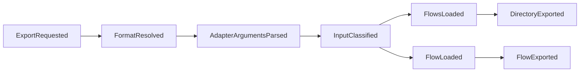
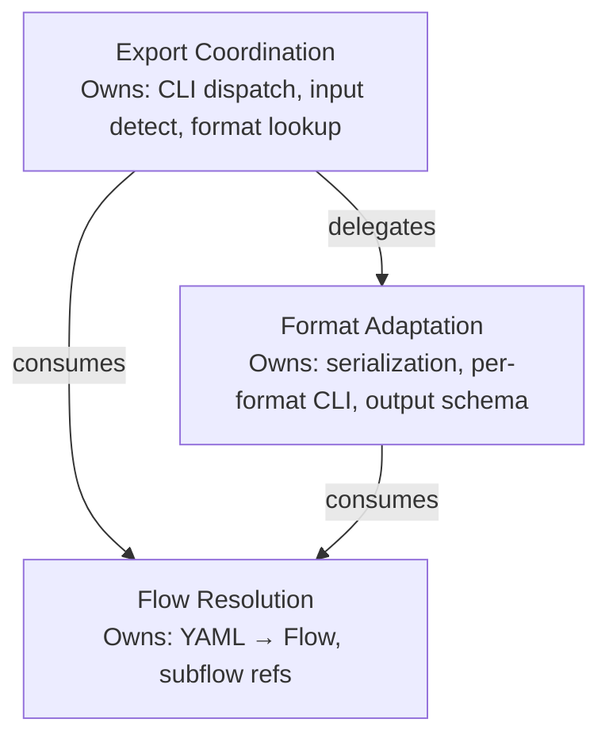

# Event Storming: flowr

Facilitated from interview IN_20260506_export-feature. Surfaces domain events, commands, bounded contexts, and aggregate candidates for the export feature.

---

## Event Map

Domain events in chronological order. Each event is a fact — something that happened, expressed in past tense.

### Timeline

### Domain Events

| # | Event | Description | Produced by |
|---|-------|-------------|-------------|
| E1 | **ExportRequested** | User invoked `flowr export --format <format> <path>` | `RequestExport` command |
| E2 | **FormatResolved** | Format name string mapped to a FlowExporter adapter instance via the EXPORTERS registry | `ResolveFormat` command |
| E3 | **AdapterArgumentsParsed** | Per-adapter CLI flags extracted from the argument namespace into adapter-specific options | `ParseAdapterArguments` command |
| E4 | **InputClassified** | Input path determined to be a single file or a directory of flow definitions | `ClassifyInput` command |
| E5 | **FlowLoaded** | A single YAML file parsed into a Flow domain object | `LoadFlow` command (existing, from `flowr.domain.loader`) |
| E6 | **SubflowsResolved** | Subflow references in a root flow resolved into a list of Flow objects with cross-references expanded | `ResolveSubflows` command (existing, from `flowr.domain.loader`) |
| E7 | **FlowExported** | A single Flow transformed into the target format by the resolved adapter | `ExportFlow` command (adapter method) |
| E8 | **DirectoryExported** | All flows from a directory exported as a collection, optionally with a `defaultFlow` key | `ExportDirectory` command (adapter method) |

### Commands

Each command is an intent — imperative verb — that triggers a domain event. Commands may fail (unknown format, missing file, parse error).

| # | Command | Triggers event | Failure mode |
|---|---------|---------------|--------------|
| C1 | **RequestExport** | ExportRequested | — (entry point) |
| C2 | **ResolveFormat** | FormatResolved | Unknown format name → error |
| C3 | **ParseAdapterArguments** | AdapterArgumentsParsed | Invalid flag values → error |
| C4 | **ClassifyInput** | InputClassified | Path does not exist → error |
| C5 | **LoadFlow** | FlowLoaded | Invalid YAML → `FlowParseError` |
| C6 | **ResolveSubflows** | SubflowsResolved | Missing subflow file → partial (already handled gracefully by existing code) |
| C7 | **ExportFlow** | FlowExported | — (adapter is responsible) |
| C8 | **ExportDirectory** | DirectoryExported | Empty directory → empty collection |

### Event–Command Pairs

| Command | → Event | Aggregate |
|---------|---------|-----------|
| `RequestExport(format, path)` | `ExportRequested` | ExportSession |
| `ResolveFormat(format_name)` | `FormatResolved` | ExportRegistry |
| `ParseAdapterArguments(args, exporter)` | `AdapterArgumentsParsed` | ExportSession |
| `ClassifyInput(path)` | `InputClassified` | ExportSession |
| `LoadFlow(path)` | `FlowLoaded` | (existing — Flow aggregate) |
| `ResolveSubflows(root_flow, root_path)` | `SubflowsResolved` | (existing — Flow aggregate) |
| `ExportFlow(exporter, flow, options)` | `FlowExported` | FlowExporter (adapter) |
| `ExportDirectory(exporter, flows, options)` | `DirectoryExported` | FlowExporter (adapter) |

---

## Context Candidates

Three bounded contexts emerge from the event grouping. Context boundaries are drawn where responsibilities and language diverge.

### C1: Export Coordination

**Events:** ExportRequested, FormatResolved, AdapterArgumentsParsed, InputClassified
**Commands:** RequestExport, ResolveFormat, ParseAdapterArguments, ClassifyInput

Orchestrates the export workflow end-to-end. Owns the CLI `export` subcommand, its argument parser, and the dispatch logic that wires format resolution → input classification → adapter invocation. This context does not understand any output format — it delegates format-specific work to the Format Adaptation context.

**Language:** format name, input path, export command, adapter options.

**Owning module:** `flowr.cli` (export subcommand handler in `__main__.py`).

### C2: Format Adaptation

**Events:** FlowExported, DirectoryExported
**Commands:** ExportFlow, ExportDirectory

Transforms loaded Flow domain objects into specific output representations. Each adapter implements the FlowExporter Protocol and owns its serialization logic, CLI argument definitions, and output schema. Adapters are autonomous: the JSON adapter defines `--flat` and `--no-attrs`; the Mermaid adapter defines `--no-conditions`. No adapter knows about other adapters.

**Language:** nodes, edges, conditions, flat mode, stateDiagram-v2, diagram separator.

**Owning module:** `flowr.exporters` (new package: `__init__.py`, `json_exporter.py`, `mermaid_exporter.py`). The Protocol lives in `flowr.domain.export.py`.

### C3: Flow Resolution

**Events:** FlowLoaded, SubflowsResolved
**Commands:** LoadFlow, ResolveSubflows

Loads YAML files into Flow domain objects and resolves subflow cross-references. This context already exists in `flowr.domain.loader`. The export feature **consumes** this context but does not own or modify it. The export feature depends on the Flow, State, Transition, and GuardCondition domain types from `flowr.domain.flow_definition`.

**Language:** flow, state, transition, trigger, guard condition, subflow, exit.

**Owning module:** `flowr.domain.loader`, `flowr.domain.flow_definition` (existing, unchanged).

### Context Map

**Relationships:**

- Export Coordination → Format Adaptation: **delegation** (coordination invokes adapter methods via Protocol)
- Export Coordination → Flow Resolution: **conformist** (consumes Flow/State/Transition types as-is)
- Format Adaptation → Flow Resolution: **conformist** (receives loaded Flow objects, does not load itself)

---

## Aggregate Candidates

### A1: ExportSession

**Context:** Export Coordination
**Consistency boundary:** A single `flowr export` invocation.

Represents one export call from start to finish. Holds the resolved format name, input path (file or directory), loaded flows, and adapter-specific options. Enforces the invariant that a format must be resolved and valid before any export begins.

**Identity:** The CLI invocation itself (ephemeral — not persisted).

**State:**
- `format_name: str` — requested format (e.g., `"json"`, `"mermaid"`)
- `input_path: Path` — file or directory
- `is_directory: bool` — classified input type
- `flows: list[Flow]` — loaded domain objects
- `adapter_options: dict[str, Any]` — per-adapter parsed flags

**Invariants:**
- Format must be resolved (present in EXPORTERS) before export
- Input path must exist on disk
- At least one flow must be loaded for export to proceed

**Root entity:** The export command handler function (ephemeral session, no persistent identity).

### A2: ExportRegistry

**Context:** Export Coordination
**Consistency boundary:** The hardcoded format → adapter mapping.

A singleton that maps format name strings to FlowExporter instances. Enforces the invariant that only registered formats are accessible. The registry is hardcoded at module load time — no runtime registration.

**Identity:** The module-level `EXPORTERS` dict (singleton).

**State:**
- `EXPORTERS: dict[str, FlowExporter]` — format name → adapter instance

**Invariants:**
- Every value implements the FlowExporter Protocol
- Keys are lowercase format names (e.g., `"json"`, `"mermaid"`)
- Lookup of unknown format raises an error

**Root entity:** The `EXPORTERS` dict in `flowr/exporters/__init__.py`.

### A3: FlowExporter (Protocol)

**Context:** Format Adaptation
**Consistency boundary:** A single adapter's serialization logic.

Each concrete adapter (JsonExporter, MermaidExporter) is an aggregate root responsible for producing correct output from input Flows. The Protocol defines the contract; each implementation enforces its own invariants (e.g., JSON must produce valid JSON, Mermaid must produce valid stateDiagram-v2).

**Identity:** The adapter instance (stateless — no mutable identity).

**Contract methods:**
- `format_name() -> str` — returns the format identifier
- `description() -> str` — human-readable description for help text
- `supports_directory() -> bool` — whether the adapter handles directory export
- `add_arguments(parser)` — registers adapter-specific CLI flags
- `export(flow, options) -> str` — exports a single flow
- `export_directory(flows, options) -> str` — exports a flow collection

**Concrete implementations:**
- **JsonExporter** — structured nodes/edges with resolved conditions; supports `--flat` (inline subflows) and `--no-attrs` (omit state attrs)
- **MermaidExporter** — stateDiagram-v2 per flow; supports `--no-conditions` (omit transition conditions); delegates to existing `to_mermaid()` in `flowr.domain.mermaid`

---

## Gaps and Follow-ups

| Gap | Description | Resolution |
|-----|-------------|------------|
| G1 | MermaidExporter wraps existing `to_mermaid()` but `to_mermaid()` does not accept options | MermaidExporter calls `to_mermaid(flow)` and post-processes (strips conditions) if `--no-conditions` is set, or `to_mermaid` gains an options parameter |
| G2 | JSON output schema not yet formally specified | Reference issue #3 proposal; schema validation deferred to architecture phase |
| G3 | Directory export ordering is undefined | Flows loaded from directory glob — sorted alphabetically by filename for deterministic output |
| G4 | `flowr mermaid` removal is a breaking change | Accepted per interview QA4; `flowr export --format mermaid` is the replacement path |
| G5 | No streaming or incremental output for large directories | Out of scope for this feature; all flows loaded into memory before export |
